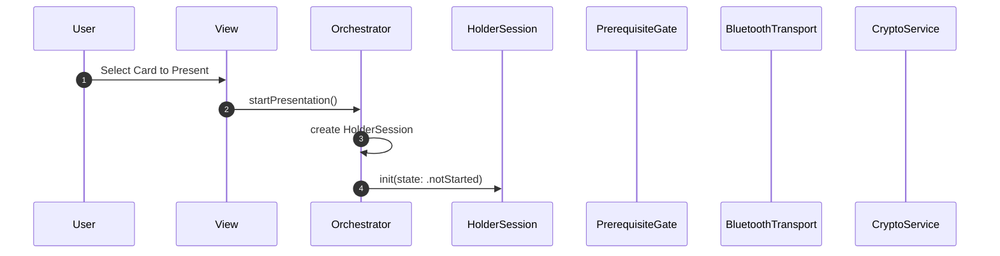
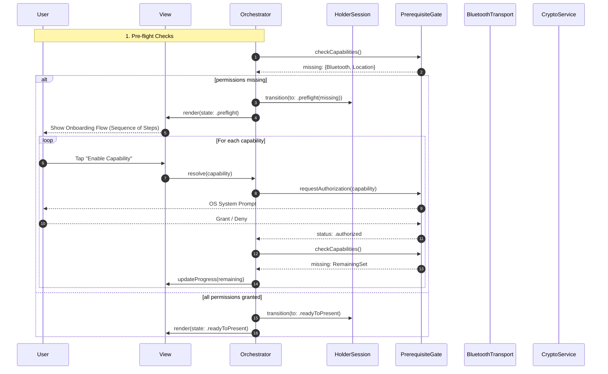
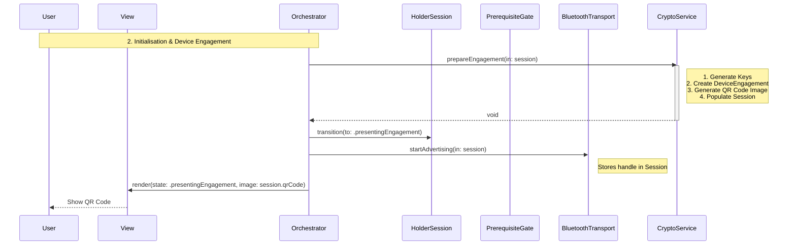
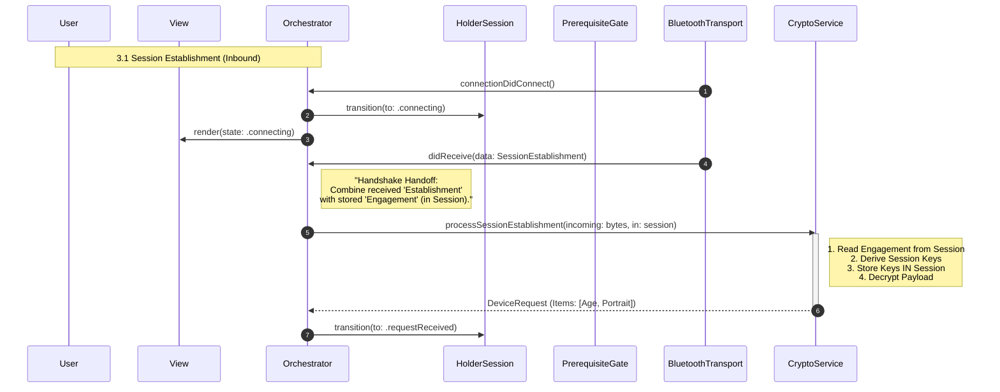
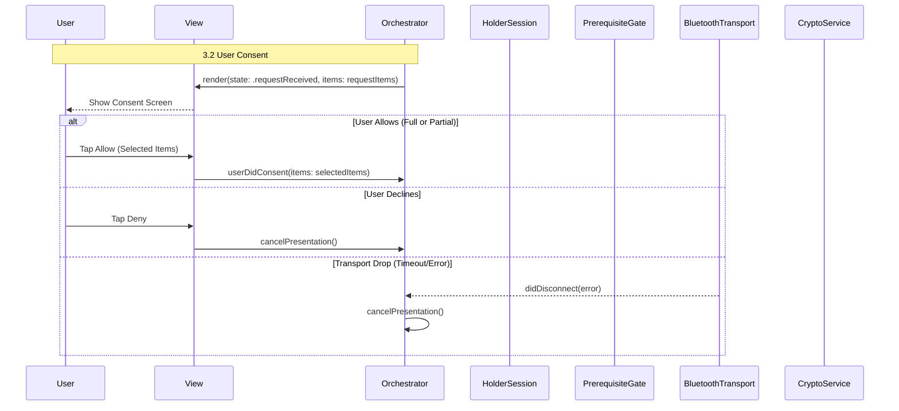
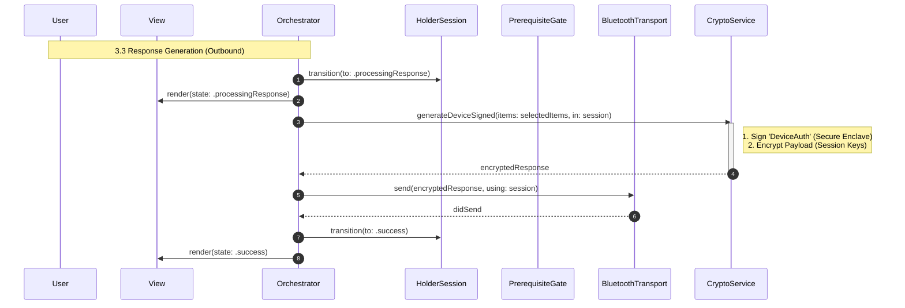
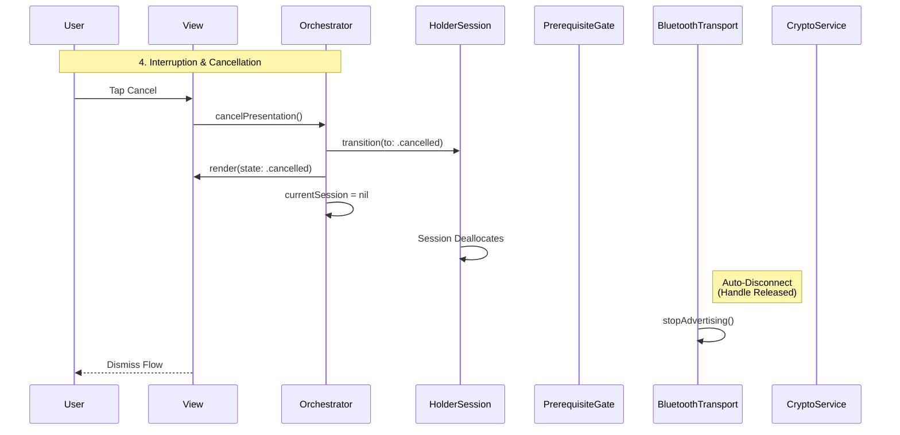

# Holder Solution Architecture

## Executive Summary

This document outlines the architectural patterns and orchestration logic
required to implement an ISO 18013-5 compliant mDL Holder. It maps the complete
transaction lifecycle from managing device permissions to the final
cryptographic proof generation and user-consented release of identity data. It
uses an Orchestrator-driven pattern that centralises and enforces app logic
state via a passive state machine.

The DCMAW-18018 Jira ticket acts as the epic for this work.

## The Mental Model: Orchestrator & Session

The architecture separates **Execution** from the current **State** in the flow.

1. **Orchestrator**
   - **Role**: The business logic of the system.
   - **Responsibility**: Owns the hardware services (Secure Storage, Bluetooth,
     Crypto). It initiates all actions (for example calling
     `bluetooth.startAdvertising(in: session)`).
   - **State Control**: Observes the results of these actions and attempts to
     transition the Session to the appropriate next state.
   - **Associated Jira tickets**:
     - `HolderOrchestrator` implementation:
       - Android: DCMAW-18153
       - iOS: DCMAW-18155
2. **HolderSession (Represents a Transaction)**
   - **Role**: Passive Finite State Machine (FSM) + Ephemeral Resource
     Container.
   - **Responsibility**: Enforces the ISO 18013-5 sequence.
   - **Evolution**: In addition to tracking _logical_ state (for example,
     "Connecting"), the Session also holds the _ephemeral resources_ for that
     transaction (for example, encryption keys, active connection handles).
   - **Benefit**: This centralizes the lifecycle. When the Orchestrator discards
     a Session, **all associated resources are automatically released/wiped.**
   - **Associated Jira tickets**:
     - `HolderSession` implementation
       - Android: DCMAW-18154
       - iOS: DCMAW-18156

## Lifecycle & Ephemerality

The `HolderSession` is a **Single-Use Object**. It corresponds 1:1 with a
specific cryptographic session.

1. **Terminal States**: Once the session reaches `.success`, `.failed`, or
   `.cancelled`, it is immutable.
2. **Handling Retries**: To restart a flow, the Orchestrator must **discard**
   the current session instance and instantiate a new one.

### Tear-Down & Cleanup

In a standard architecture, the Orchestrator would manually track resources
(keys, connections) and must remember to release them on every exit path (error,
cancel, success). This is error-prone; a missed tear-down step could leave keys
in memory or the Bluetooth radio running.

By anchoring these ephemeral resources to the `HolderSession`, we enable
**automatic cleanup**.

- The Orchestrator simply manages the _Session_.
- When the Session is de-allocated (for example, `currentSession = nil`), the
  Session's `deinit` triggers the destruction of its contents: keys are wiped,
  and Bluetooth connections are terminated.
- This delivers robust security and battery management with minimal code
  complexity in the Orchestrator.

## Session Integrity & Mutability

A potential risk with the "decorator" pattern (where Services populate a mutable
Session object) is that data could be injected out of sequence or into the wrong
session. To mitigate this, the `HolderSession` enforces **State-Gated
Mutability**:

1. **Write Protection:** Critical properties (keys, handles) are `private(set)`.
   Services cannot modify them directly.
2. **Gated Mutators:** The Session exposes specific methods for services to
   inject data, which strictly validate the current state.
   - `setEngagement(_:)`: Valid only in `.notStarted`. Locks the keys.
   - `setConnection(_:)`: Valid only in `.presenting`. Locks the handle.
   - `setRequest(_:)`: Valid only in `.connecting`.
3. **Immutable History:** Once a critical property is set (for example,
   Ephemeral Keys), it is **sealed**. Any attempt to overwrite it triggers a
   fatal error and invalidates the session. This prevents "Session Swapping"
   attacks where an orchestrator might mistakenly use an active session for a
   new engagement.

## Architectural Flow

The presentation process is divided into four distinct and sequential phases,
mirroring the Verifier lifecycle:

1. **Pre-flight Checks**: Ensuring capabilities (Bluetooth, Location as needed)
   are authorised.
   - **Associated Jira tickets**:
     - Listen to / standardise app permission state: (Android: DCMAW-18019/iOS:
       DCMAW-18021)
     - Implement holder pre-flight checks: (iOS: DCMAW-18396)
     - Integrate UI with holder pre-flight checks: (iOS: DCMAW-18471)
2. **Device Engagement**: Generating and displaying the QR code.
   - **Associated Jira tickets**:
     - Initialise Holder device engagement (iOS: DCMAW-18470)
3. **Transport & Data**:
   - _Inbound_: Accepting the connection and parsing the request.
   - _Consent_: Waiting for User Consent.
   - _Outbound_: Generating proofs and sending the response.
4. **Completion**: Tearing down the connection.

## System Components

- Orchestrator
- HolderSession
- PrerequisiteGate
- BluetoothTransport
- CryptoService
- UI Layer

## Holder Session States

Holder Session is a state machine, deciding what screen should show (for
example, permissions needed, scanning in progress, connected, reading, success,
failure) and triggering one-off effects or actions.

<details>
<summary>Android HolderSessionState sealed class</summary>

```kotlin
sealed class HolderSessionState {
    data object NotStarted : HolderSessionState()
    data class Preflight(
        val missingPermissions: Set<String>
    ) : HolderSessionState()
    data object ReadyToPresent : HolderSessionState()
    data object PresentingEngagement : HolderSessionState()
    data object Connecting : HolderSessionState()
    data object RequestReceived : HolderSessionState()
    data object ProcessingResponse : HolderSessionState()
    sealed class Complete(val reason: String) : HolderSessionState() {
        data class Success(
            val data: DeviceResponse
        ) : Complete("Successful journey")
        data class Failed(val error: SessionError) : Complete(error.message)
        data object Cancelled : Complete("Journey cancelled by User")
    }
}
```

</details>

<details>
<summary>iOS HolderSessionState enum</summary>

```swift
enum HolderSessionState: Equatable {
    case notStarted
    case preflight(missing: Set<Permission>)
    case readyToPresent
    case presentingEngagement
    case connecting
    case requestReceived
    case processingResponse
    case success(data: DeviceResponse)
    case failed(error: SessionError)
    case cancelled
}
```

</details>

<table>
  <tr>
    <td><strong>Diagram Phase</strong></td>
    <td><strong>State</strong></td>
    <td><strong>UI Responsibility</strong></td>
  </tr>

  <tr>
    <td><a id="startup">Startup</a></td>
    <td>NotStarted</td>
    <td>Load credential metadata.</td>
  </tr>

  <tr>
    <td rowspan="2"><a id="#1-pre-flight-checks">1. Pre-flight Checks</a></td>
    <td>Preflight</td>
    <td>Show permission request screen.</td>
  </tr>
  <tr>
    <td>ReadyToPresent</td>
    <td>Permissions confirmed, ready to start.</td>
  </tr>

  <tr>
    <td><a id="#2-initialisation--device-engagement">2. Initialisation &amp; Device Engagement</a></td>
    <td>PresentingEngagement</td>
    <td>Render QR Code.</td>
  </tr>

  <tr>
    <td rowspan="3"><a id="#3-transport--data">3. Transport &amp; Data</a></td>
    <td>Connecting</td>
    <td>Show "Connecting…" (Verifier is scanning).</td>
  </tr>
  <tr>
    <td>RequestReceived</td>
    <td>Display requested fields and "Allow/Deny" buttons for User Consent.</td>
  </tr>
  <tr>
    <td>ProcessingResponse</td>
    <td>Show "Generating Proof…".</td>
  </tr>

  <tr>
    <td rowspan="2"><a id=#4-completion>4. Completion</a></td>
    <td>Success</td>
    <td>Show "Sent Successfully".</td>
  </tr>
  <tr>
    <td>Failed</td>
    <td>Handle specific errors.</td>
  </tr>

  <tr>
    <td><a id="#4-interruption--cancellation">Interruption &amp; Cancellation</a></td>
    <td>Cancelled</td>
    <td>Dismiss the flow.</td>
  </tr>
</table>

## Startup

The **Orchestrator** is a long-lived object that persists across the lifecycle
of the app, or feature.

When the user selects a card to present, the **Orchestrator** instantiates a
fresh `HolderSession` in the `NotStarted` state.

This session instance is ephemeral: it lives only for the duration of this
specific transaction. If the transaction fails or completes, this specific
session object is discarded.



## 1. Pre-flight Checks

This phase ensures the device is capable of performing the transaction before we
attempt any cryptography or UI rendering.

With the `HolderSession` in `NotStarted` state, the **Orchestrator** calls the
`PrerequisiteGate` to check firstly that device capabilities are present, and
then that the User has granted permission to access them.

The mDL transaction relies on Bluetooth Low Energy (BLE) to transfer data. On
Android, this requires granting Location permissions as well.

The `PrerequisiteGate` returns with a set of missing capabilities, if any. The
Orchestrator transitions the `HolderSession` into a state of
`Preflight(missing: {<Capability>})`.

By passing this as a set, this enables the `View` and `Orchestrator` to present
an onboarding flow with the correct number of steps. For example, if the set
contains both Bluetooth and Location as missing permissions, the view can
prepare onboarding that presents these sequentially with explanations for each.

As the User grants or denies each permission, this triggers the Orchestrator to
retry the check which loops until all permissions are granted.

Once the `PrerequisiteGate` determines that there are no missing capabilities,
the Orchestrator transitions the `HolderSession` to a `ReadyToPresent` state.



## 2. Initialisation & Device Engagement

_This phase covers the setup of cryptographic material and the generation of the
QR code._

Once pre-flight checks are completed, Device Engagement can begin.

The **Orchestrator** awaits the call to `crypto.prepareEngagement(in: session)`.

The `CryptoService` performs the heavy lifting:

1. Generates the ephemeral key pair.
2. Creates the `DeviceEngagement` structure.
3. **Generates the QR Code image** from the engagement data.

It **decorates the session directly**:

1. **Private Context**: `session.cryptoContext` (Private Keys).
2. **UI Assets**: `session.qrCode` (The generated image).

The Orchestrator waits for this process to complete, then transitions to
`PresentingEngagement` and passes the generated QR code to the View.



## 3. Transport & Data

_This phase covers the "Server" role: connecting, receiving the question,
obtaining consent and answering._

Unlike the Verifier, this phase is **bidirectional and interrupted**. It
consists of 3 distinct steps:

### 3.1. Session Establishment (Inbound)

The **Orchestrator** instructs the `BluetoothTransport` to start advertising and
accept the BLE connection. When the `SessionEstablishment` message is received,
the Orchestrator passes the raw data **and the current Session** to the
`CryptoService`.

The `CryptoService` uses the session's internal context (the keys generated in
step 2) to derive the new session-specific keys, **stores them back into the
session**, and decrypts the request.

It returns the valid **`DeviceRequest`** (containing the requested data items)
to the Orchestrator.

Even though the `Session` acts as the container for state (keys, etc.),
returning the request object to the Orchestrator allows the business logic to
immediately inspect what is being asked for and pass those specific items to the
**View** for user consent (as shown in step 3.2).

Upon successful decryption, the Orchestrator transitions the `HolderSession` to
the `RequestReceived` state.



### 3.2. User Consent (The Decision)

The Orchestrator passes the `requestItems` (parsed in Step 3.1) to the View for
presentation.

During this user interaction, the `HolderSession` plays a critical role: it
retains the **active Bluetooth connection handle** and the **ephemeral session
keys**. This keeps the connection "warm" and secure without the Orchestrator
needing to manage low-level handles.

**Transport Constraints:** The BLE connection must be maintained during this
pause. If the `BluetoothTransport` reports a disconnection (for example, due to
signal loss or supervision timeout), the Orchestrator immediately triggers the
Cancellation flow (see Section 4).

The user reviews the request (for example, "Verifier wants: Age over 18") and
taps **Allow** (confirming the specific data items to release) or **Deny**.



### 3.3. Response Generation (Outbound)

Once the user consents, the Orchestrator resumes execution.

It transitions to `ProcessingResponse` and then calls
`crypto.generateDeviceSigned(items: selectedItems, in: session)`.

The `CryptoService` performs two distinct cryptographic operations:

1. **Device Authentication (MdocAuth):** It signs the `DeviceAuth` structure
   using the device's private key (held in the Secure Enclave). This proves the
   data comes from a genuine mDL.
2. **Session Encryption:** It encrypts the signed payload using the ephemeral
   session keys (derived from the session transcript).

The Orchestrator then transmits this response via the `BluetoothTransport`
(which also uses the handle stored in the session). Finally, it transitions the
`HolderSession` to `Success`.



## 4. Interruption & Cancellation

The cancellation flow handles user-initiated interruptions or system failures
(for example, Bluetooth timeout).

### Transport Signals

If the `BluetoothTransport` emits a disconnection signal or error at any point
during the active session (Steps 2-3), the Orchestrator treats this as a fatal
error. It immediately triggers the cancellation flow.

- **Why:** ISO 18013-5 session security relies on the binding of the ephemeral
  keys to the transport session. If the transport drops, the security context is
  invalidated. We can't "resume" a dropped connection; we must start a new
  session.

### The Cleanup Mechanism (RAII)

The system relies on a **Connection Handle** pattern to ensure the radio spins
down:

1. When `BluetoothTransport` starts, it returns a `ConnectionHandle` object to
   the `Session`.
2. This Handle holds a `weak` reference back to the Transport.
3. When the `Session` is de-allocated (set to nil), it releases the Handle.
4. **Crucially:** The Handle's `deinit` method automatically calls
   `transport.disconnect()` or `stopAdvertising()`.

This ensures that if the Session dies (for any reason), the connection is
forcibly terminated.


