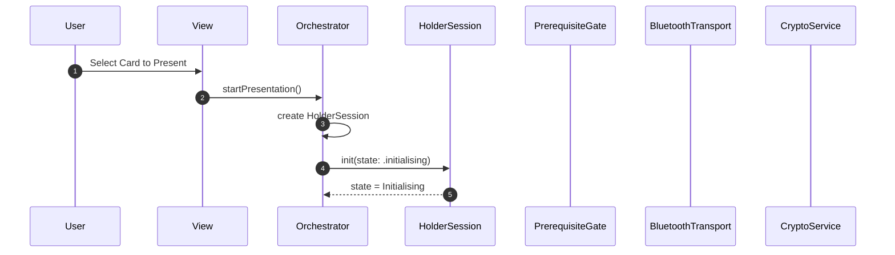
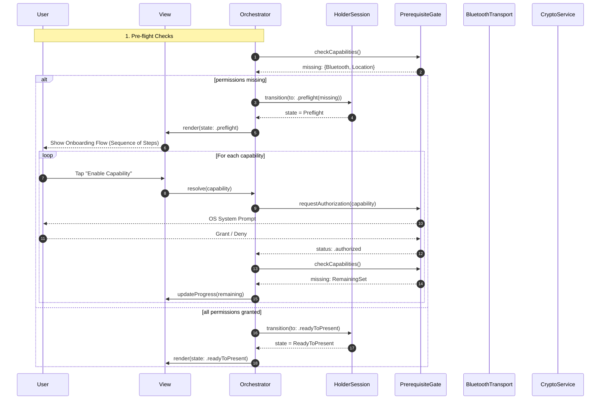
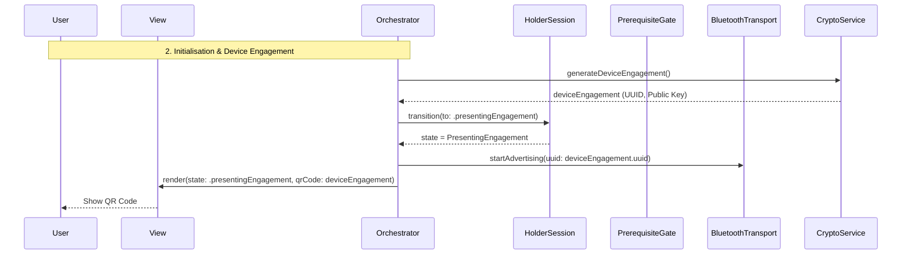
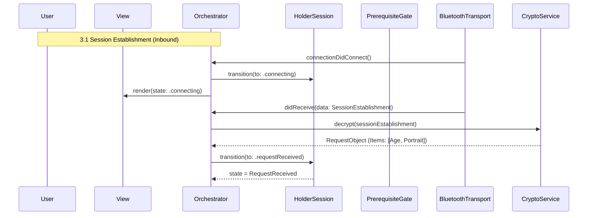
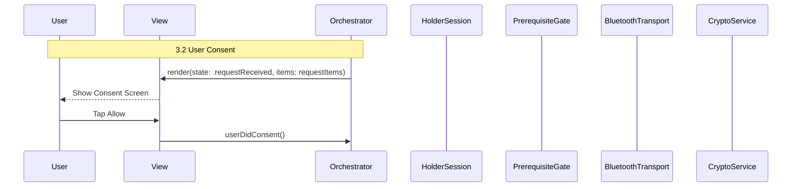
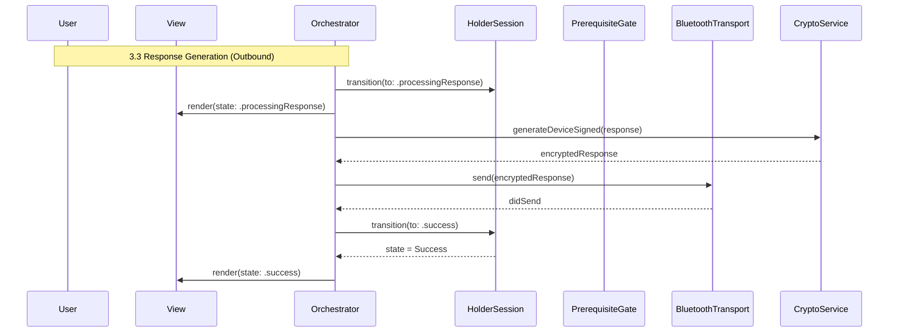
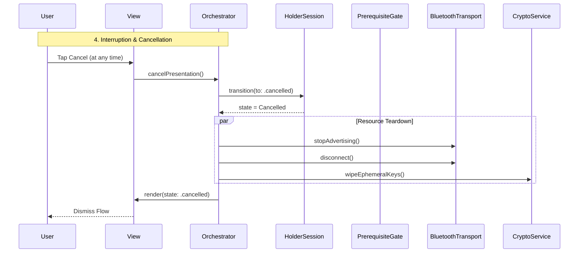

# Holder Solution Architecture

## Executive Summary

This document outlines the architectural patterns and orchestration logic required to implement an ISO 18013-5 compliant mDL Holder. It maps the complete transaction lifecycle from managing device permissions to the final cryptographic proof generation and user-consented release of identity data. It uses an Orchestrator-driven pattern where application logic is centralised, and state is enforced by a passive state machine.

## The Mental Model: Orchestrator & Session

The architecture separates **Execution** (doing things) from **State** (tracking where we are in the flow).

1. **Orchestrator**
    - **Role**: The business logic of the application.
    - **Responsibility**: Owns the hardware services (Secure Storage, Bluetooth, Crypto). It initiates all actions (e.g. calling `bluetooth.startAdvertising()`).
    - **State Control**: Observes the results of these actions and attempts to transition the Session to the appropriate next state.
2. **HolderSession (the map)**
    - **Role**: Passive Finite State Machine (FSM).
    - **Responsibility**: Enforces the ISO 18013-5 sequence. It does not perform work or side effects.
    - **The Guardrail**: Exposes a `transition(to: State)` method and validates that the requested transition is legal based on the current state.

## Lifecycle & Ephemerality

The `HolderSession` is a **Single-Use Object**. It corresponds 1:1 with a specific cryptographic session.

1. **Terminal States**: Once the session reaches `.success`, `.failed`, or `.cancelled`, it is immutable. It cannot be reset or rewound.
2. **Handling Retries**: To restart a flow, the Orchestrator must **discard** the current session instance and instantiate a new one. This ensures that a fresh set of Ephemeral Keys and a new Session Transcript are generated for every attempt.

## Architectural Flow

The presentation process is divided into four distinct and sequential phases, mirroring the Verifier lifecycle:

1. **Pre-flight Checks**: Ensuring capabilities (Bluetooth, Location as needed) are authorised.
2. **Device Engagement**: Generating and displaying the QR code.
3. **Transport & Data**:
    - *Inbound*: Accepting the connection and parsing the request.
    - *Interruption*: Waiting for User Consent.
    - *Outbound*: Generating proofs and sending the response.
4. **Completion**: Tearing down the connection.

## System Components

- Orchestrator
- HolderSession
- PrerequisiteGate
- BluetoothTransport
- CryptoService

## Holder Session States

Holder Session is a state machine, deciding what screen should show (e.g. permissions needed, scanning in progress, connected, reading, success, failure) and triggering one-off effects or actions.

```swift
enum HolderSessionState: Equatable {
	case initialising
	case preflight(missing: Set<Permission>)
	case readyToPresent
	case presentingEngagement
	case connecting
	case requestReceived
	case processingResponse
	case success(data: DeviceResponse)
	case failed(error: SessionError)
	case cancelled
}
```

| Diagram Phase | State | UI Responsibility |
| --- | --- | --- |
| Startup | Initialising | Load credential metadata. |
| 1. Pre-flight Checks | Preflight | Show permission request screen. |
| 1. Pre-flight Checks | ReadyToPresent | Permissions confirmed, ready to start. |
| 2. Initialisation &amp; Device Engagement | PresentingEngagement | Render QR Code. |
| 3. Transport &amp; Data | Connecting | Show "Connecting…" (Verifier is scanning). |
| 3. Transport &amp; Data | RequestReceived | Display requested fields and "Allow/Deny" buttons for User Consent. |
| 3. Transport &amp; Data | ProcessingResponse | Show "Generating Proof…". |
| 4. Completion | Success | Show "Sent Successfully". |
| 4. Completion | Failed | Handle specific errors. |
| Interruption &amp; Cancellation | Cancelled | Dismiss the flow. |

## Startup

The **Orchestrator** is a long-lived object that persists across the application lifecycle (or screen lifecycle).

When the user selects a card to present, the **Orchestrator** instantiates a fresh `HolderSession` in the `Initialising` state.

This session instance is ephemeral: it lives only for the duration of this specific transaction. If the transaction fails or completes, this specific session object is discarded.



## 1. Pre-flight Checks

This phase ensures the device is capable of performing the transaction before we attempt any cryptography or UI rendering.

With the `HolderSession` in `Initialising` state, the **Orchestrator** calls the `PrerequisiteGate` to check firstly that device capabilities are present, and then that the User has granted permission to access them.

The mDL transaction relies on Bluetooth Low Energy (BLE) to transfer data. On Android, this requires Location permissions to be granted as well.

The `PrerequisiteGate` returns with a set of missing capabilities, if any. The Orchestrator transitions the `HolderSession` into a state of `Preflight(missing: {<Capability>})`.

By passing this as a set, this enables the `View` and `Orchestrator` to present an onboarding flow with the correct number of steps. For example, if the set contains both Bluetooth and Location as missing permissions, the view can prepare onboarding that presents these sequentially with explanations for each.

As the User grants or denies each permission, this triggers the Orchestrator to retry the check which loops until all permissions are granted.

Once the `PrerequisiteGate` determines that there are no missing capabilities, the Orchestrator transitions the `HolderSession` to a `ReadyToPresent` state.



## 2. Initialisation & Device Engagement

*This phase covers the setup of cryptographic material and the generation of the QR code.*

Once pre-flight checks are completed, Device Engagement can begin.

The **Orchestrator** instructs the `CryptoService` to generate the `DeviceEngagement` structure, which contains:

1. **BLE Service UUID**: The unique address the Verifier will need to find this specific device.
2. **Device Public Key**: the key needed for the Verifier to start the encrypted session.

Once generated, the UI renders this as a QR code, and the Orchestrator transitions the `HolderSession` to `PresentingEngagement`.



## 3. Transport & Data

*This phase covers the "Server" role: connecting, receiving the question, obtaining consent and answering.*

Unlike the Verifier, this phase is **bidirectional and interrupted**. It consists of 3 distinct steps:

### 3.1. Session Establishment (Inbound)

The **Orchestrator** instructs the `BluetoothTransport` to start advertising and accept the BLE connection. When the `SessionEstablishment` message is received, the Orchestrator passes it to the `CryptoService` to decrypt the payload.

Upon successful decryption, the Orchestrator transitions the `HolderSession` to the `RequestReceived` state.



### 3.2. User Consent (The Decision)

The UI displays the request (e.g. "Verifier wants: Age over 18"). The session stays in this state until the user explicitly taps **Allow** or **Deny**.



### 3.3. Response Generation (Outbound)

Once consented, the Orchestrator resumes. It instructs the `CryptoService` to generate the `DeviceSigned` structure and transmits the encrypted response via `BluetoothTransport`.

The Orchestrator then transitions the `HolderSession` to `ProcessingResponse` and finally to `Success`.



## 4. Interruption & Cancellation

The cancellation flow handles user-initiated interruptions at any stage of the presentation process.

When cancellation occurs, the **Orchestrator** must terminate and tear down transports, and wipe all ephemeral session keys from memory.

The Orchestrator transitions the `HolderSession` to a final `Cancelled` state, signalling the UI to dismiss the presentation flow.

