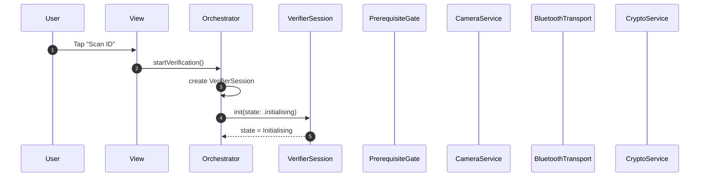
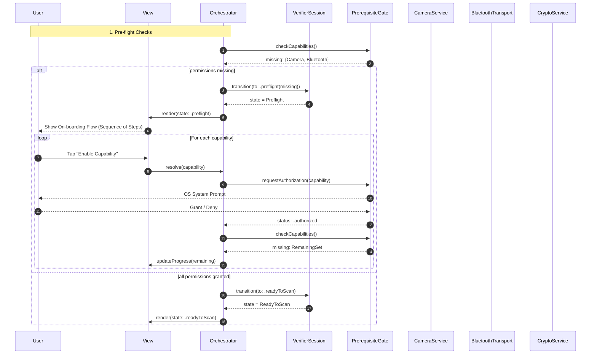
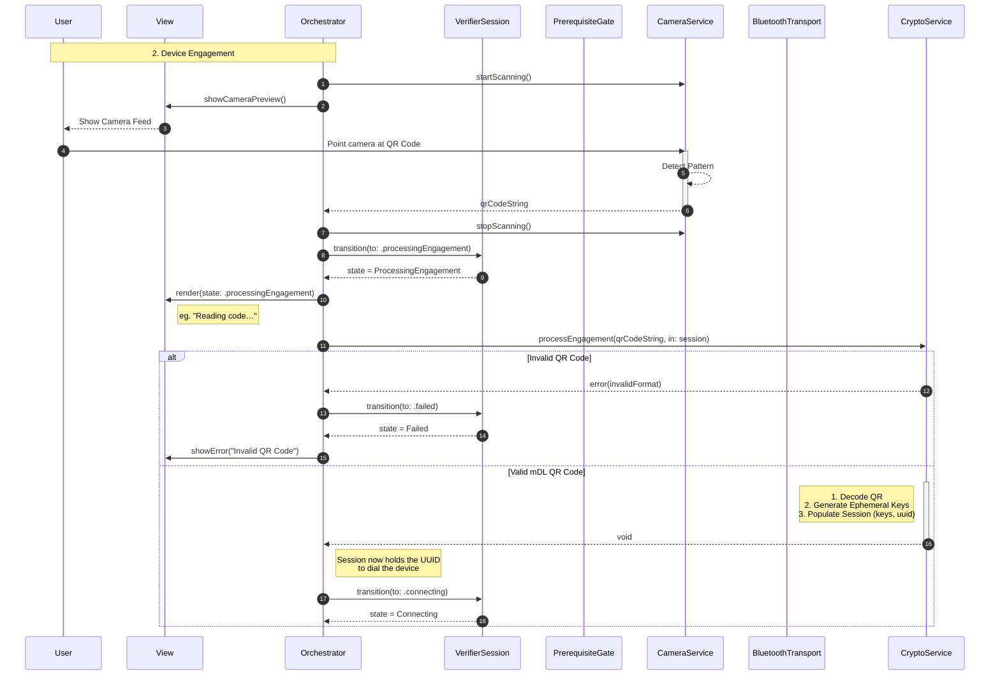
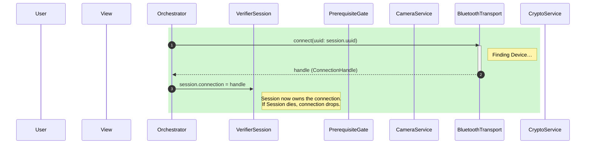
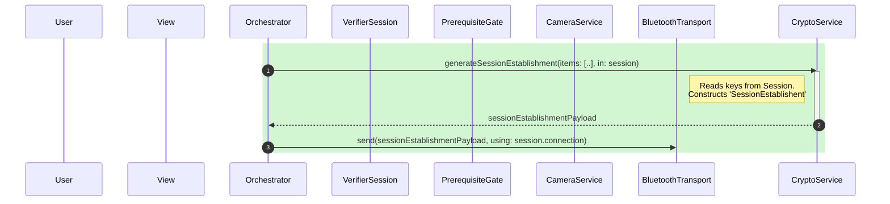
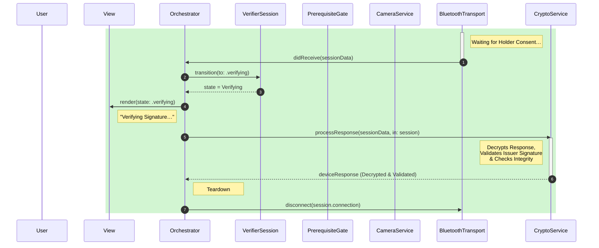
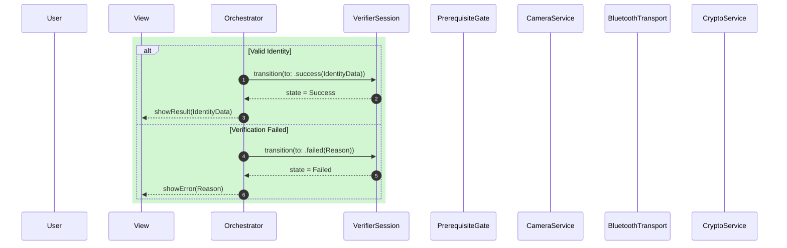
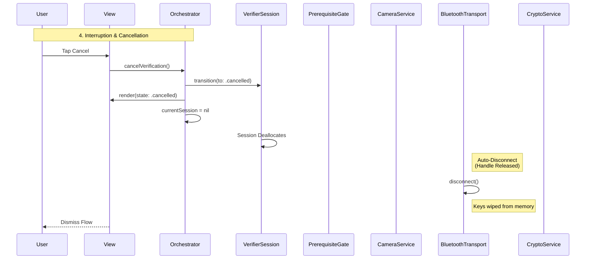

# Verifier Solution Architecture

## Executive Summary

This document outlines the architectural patterns and orchestration logic
required to implement an ISO 18013-5 compliant mDL Verifier. It maps the
complete transaction lifecycle from managing device permissions to the final
cryptographic validation of a mobile ID. It uses an Orchestrator-driven pattern
that centralises and enforces app logic state via a passive state machine.

## The Mental Model: Orchestrator & Session

The architecture separates **Execution** (doing things) from **State** (tracking
the User's position in the flow).

1. `Orchestrator`
    - **Role**: The business logic of the app.
    - **Responsibility**: Owns the hardware services (Bluetooth, Crypto,
      Camera). It initiates all actions (for example, calling
      `bluetooth.connect()`).
    - **State Control**: Observes the results of these actions and attempts to
      transition the Session to the appropriate next state.
    - **Associated Jira tickets**:
      - `VerifierOrchestrator` implementation:
        - Android: DCMAW-18157
        - iOS: DCMAW-18159
2. **VerifierSession (Represents a Transaction)**
    - **Role**: Passive Finite State Machine (FSM) + Ephemeral Resource
      Container.
    - **Responsibility**: Enforces the ISO 18013-5 sequence.
    - **Evolution**: In addition to tracking _logical_ state (for example,
      "Connecting"), the Session also holds the _ephemeral resources_ for that
      transaction (for example, encryption keys, active connection handles).
    - **Benefit**: This centralizes the lifecycle. When the Orchestrator discards
      a Session, **all associated resources are automatically released/wiped.**
    - **Associated Jira tickets**:
      - `VerifierSession` implementation:
        - Android: DCMAW-18158
        - iOS: DCMAW-18160

## Lifecycle & Ephemerality

The `VerifierSession` is a **Single-Use Object**. It corresponds 1:1 with a
specific cryptographic session.

1. **Terminal States**: Once the session reaches `.success`, `.failed`, or
  `.cancelled`, it's immutable. It can't be reset or rewound.
2. **Handling Retries**: To restart a flow (for example, after a Bluetooth
   drop), the `Orchestrator` must **discard** the current session instance and
   instantiate a new one. This ensures that a fresh set of Ephemeral Keys and
   generates a new Session Transcript for every attempt, strictly adhering to
   the ISO 18013-5 security model.

### Tear-Down & Cleanup

In a standard architecture, the Orchestrator would manually track resources
(keys, connections) and must remember to release them on every exit path (error,
cancel, success). This is error-prone; a missed tear-down step could leave keys
in memory or the Bluetooth radio running.

By anchoring these ephemeral resources to the `VerifierSession`, we enable
**automatic cleanup**.

- The Orchestrator simply manages the _Session_.
- When the Session is de-allocated (for example, `currentSession = nil`), the
  Session's `deinit` triggers the destruction of its contents: keys are wiped,
  and Bluetooth connections are terminated.
- This delivers robust security and battery management with minimal code
  complexity in the Orchestrator.

## Architectural Flow

The verification process divides into four distinct and unidirectional,
sequential phases:

1. **Pre-flight Checks**: Authorises required capabilities:
   - Bluetooth
   - Camera
   - **Associated Jira tickets**:
     - Listen to / standardise app permission state:
       - Android: DCMAW-18019
       - iOS: DCMAW-18021
2. **Device Engagement**: Capturing the QR code to extract the Holder’s identity
   and initialise session cryptography.
3. **Transport & Data**: Establishing the secure Bluetooth Low Energy (BLE)
   tunnel, sending the request, and retrieving the encrypted response.
4. **Completion**: Validating the cryptographic trust chain and tearing down
   the connection.

## System Components

- Orchestrator
- VerifierSession
- PrerequisiteGate
- BluetoothTransport
- CameraService
- CryptoService

## Verifier Session

Verifier Session is a state machine, deciding what screen should show.
For example, the permissions needed, scanning in progress, connected, reading,
success, or failure of the User journey and triggering one-off effects or
actions such as launching permission prompt, starting a system activity.

<details>
<summary>Android VerifierSessionState sealed class</summary>

```kotlin
sealed class  VerifierSessionState {
    data object NotStarted : VerifierSessionState()
    data class Preflight(
        val missingPermissions: Set<String>
    ) : VerifierSessionState()
    data object ReadyToScan : VerifierSessionState()
    data object Connecting : VerifierSessionState()
    data object ProcessingEngagement : VerifierSessionState()
    data object Verifying: VerifierSessionState()
    sealed class Complete( val reason: String) : VerifierSessionState() {
        data class Success(
            val data: DeviceResponse
        ) : Complete("Successful journey")
        data class Failed(
            val error: SessionError
        ) : Complete(error.message, error.exception)
        data object Cancelled : Complete("Journey cancelled by User")
    }
}
```

</details>

<details>
<summary>iOS VerifierSessionState enum</summary>

```swift
enum VerifierSessionState: Equatable {
 case notStarted
 case preflight(missing: Set<Permission>)
 case readyToScan
 case processingEngagement
 case connecting
 case verifying
 case success(data: DeviceResponse)
 case failed(error: SessionError)
 case cancelled
}
```

</details>

| Diagram Phase | State | UI Responsibility |
| --- | --- | --- |
| Startup | Initialising | Show a skeleton loader or generic "Starting…" state. |
| 1. Pre-flight Checks | Preflight | If this state is active, the capabilities aren't determined. Render a view explaining to the user the need for the missing permission. |
| 1. Pre-flight Checks | ReadyToScan | Confirms permissions, start the Camera. |
| 2. Device Engagement | ProcessingEngagement | Indicate to the user that a scan was successfully completed. |
| 3. Transport &amp; Data | Connecting | This covers the BLE connection + Session Establishment. |
| 3. Transport &amp; Data | Verifying | This covers Data Retrieval. |
| 4. Completion | Success | Display the relevant data. |
| 4. Completion | Failed | Handle specific errors, such as prompting to fix settings, or show a generic error. |
| Interruption &amp; Cancellation | Cancelled | Dismiss the flow. |

## Startup

The `Orchestrator` is a long-lived object that persists across the app lifecycle
(or screen lifecycle).

When the user initiates a transaction, the `Orchestrator` instantiates a fresh
`VerifierSession` in the `Initialising` state.

This session instance is ephemeral: it lives only for the duration of this
specific transaction. Discards the specific session object if the transaction
fails or completes.



## 1. Pre-flight Checks

The flow for Verification requires several device capabilities to work,
including access to **Camera** (for scanning a QR code to initiate a session),
**Bluetooth** (for data exchange) and, on Android, **Location** (for pairing).

With the `VerifierSession` in `Initialising` state, the `Orchestrator` calls the
`PrerequisiteGate` to check firstly that device capabilities are present, and
then that the User has granted permission to access them.

The `PrerequisiteGate` returns with a set of missing capabilities, if any. The
`Orchestrator` transitions the `VerifierSession` into a state of
`Preflight(missing: {<Capability>})`.

By passing this as a set, this enables the View and ViewModel to present an
on-boarding flow with the correct number of steps. For example, if the set
contains both Camera and Bluetooth as missing permissions, the view can prepare
on-boarding that presents these sequentially with explanations for each.

The Orchestrator loops through each permission, retrying each check until
they're granted.

Once the `PrerequisiteGate` determines that there are no missing capabilities,
the `Orchestrator` transitions the `VerifierSession` to a `ReadyToScan` state.



## 2. Device Engagement

Completing the pre-flight checks then begins the Device Engagement.

The `Orchestrator` instructs the `CameraService` to start scanning. When the
user scans a presented QR code, the `CameraService` returns the detected code
to the `Orchestrator`, which then stops the camera.

With this raw string, the `Orchestrator` transitions the `VerifierSession` to
`ProcessingEngagement`.

The `Orchestrator` passes the string and the **current session** to the
`CryptoService` (`processEngagement(qrCodeString, in: session)`).

The `CryptoService` performs the heavy lifting:

1. Decodes and validates the engagement structure.
2. Generates an ephemeral key pair for the Verifier.
3. Calculates the Session Transcript.

It **decorates the session directly**:

- **Private Context**: `session.cryptoContext` (Session Keys).
- **Target Identity**: Stores the UUID and Device Public Key in the session for
  the Transport layer to use.

Notice that the `Orchestrator` calls the `CryptoService` before interacting with
Bluetooth. This is because mDL requires encryption from the very first message.

With the keys established and stored in the session, the `Orchestrator`
transitions the `VerifierSession` to the `Connecting` state.



## 3. Transport & Data

With the `VerifierSession` in the `Connecting` state, the `Orchestrator` begins
the transport phase.

This includes two key components according to the ISO specification:

1. **Session Establishment**: the act of sending the first message to “open” the
   secure tunnel.
2. **Data Retrieval**: the entire phase of asking for data and getting a
   response.

### 3.1. Transport Layer Setup

The `Orchestrator` instructs the `BluetoothTransport` layer to initiate a
connection using the specific Service UUID stored in the `VerifierSession`.

Crucially, the `BluetoothTransport` returns a **Connection Handle** which acts
as a token for the active connection.

The Orchestrator stores this handle **in the VerifierSession**.



### 3.2. Session Establishment

Once connected, the `Orchestrator` requests the `CryptoService` to construct the
`SessionEstablishment` message **using the session context**.

The ISO standard defines a single message structure called
`SessionEstablishment` that carries both:

1. The Verifier’s Public Key (`eReaderKey`)—so the Holder can generate their
   own shared secret.
2. The Encrypted Request (`DeviceRequest`)—the actual attributes we're asking
   for.

The `Orchestrator` sends this combined payload via the `BluetoothTransport` to
the Holder.

> **Note:** By binding the session keys to the original QR code (via the Session
> Transcript), we ensure we are connecting to the exact device that was scanned.



### 3.3. Data Retrieval

The `Orchestrator` waits for the Holder to consent and respond. Upon receiving
the `SessionData` payload, the `BluetoothTransport` passes the encrypted bytes
to the `Orchestrator`. The `Orchestrator` transitions the `VerifierSession` to
`Verifying` and passes the data to `CryptoService`.

The service performs three actions using the context in the `session`:

1. **Decryption**: Unlocks the `DeviceResponse` using the derived session keys.
2. **Trust Validation**: Verifies the digital signature of the
   Mobile Security Object (MSO) against the Trusted Issuer Root CA.
3. **Integrity Check**: Confirms that the hashes of the received data elements
   match the signed digests in the MSO.

Once processing is complete, the `Orchestrator` triggers the transport layer to
disconnect.



### 3.4. Completion

The `Orchestrator` concludes the session by transitioning to a final state:

- **Success**: Returns the decrypted identity object for display if verification
  passes.
- **Failure**: Returns a specific error if signature validation fails or the
  connection drops.



## 4. Interruption & Cancellation

The cancellation flow handles user-initiated interruptions or system failures
(for example, Bluetooth timeout).

### The Cleanup Mechanism (RAII)

The system relies on a **Connection Handle** pattern to ensure the radio spins
down:

1. When `BluetoothTransport` starts, it returns a `ConnectionHandle` object to
   the `Session`.
2. This Handle holds a `weak` reference back to the Transport.
3. When the `Session` is de-allocated (set to nil), it releases the Handle.
4. **Crucially:** The Handle's `deinit` method automatically calls
   `transport.disconnect()` or `stopAdvertising()`.

This ensures that if the Session dies (for any reason), the connection is
forcibly terminated.


