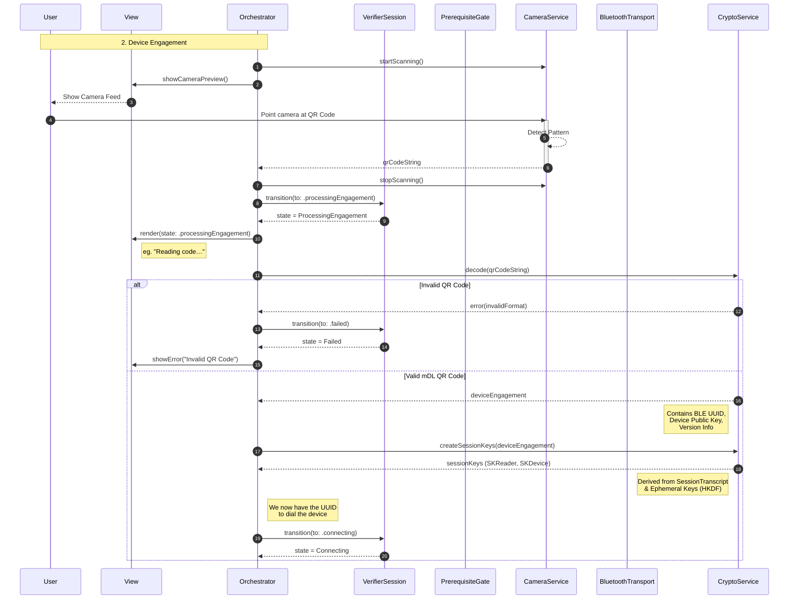
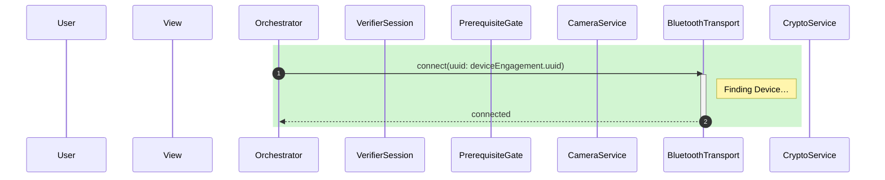
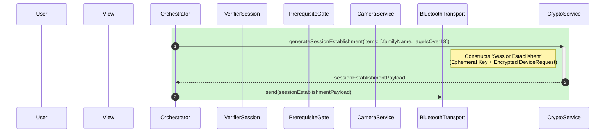
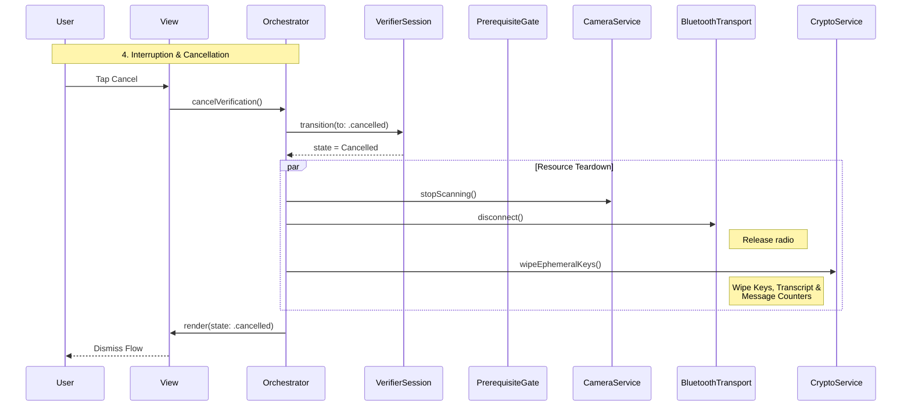

# Verifier Solution Architecture

## Executive Summary

This document outlines the architectural patterns and orchestration logic required to implement an ISO 18013-5 compliant mDL Verifier. It maps the complete transaction lifecycle from managing device permissions to the final cryptographic validation of a mobile ID. It uses an Orchestrator-driven pattern where application logic is centralised, and state is enforced by a passive state machine.

## The Mental Model: Orchestrator & Session

The architecture separates **Execution** (doing things) from **State** (tracking where we are in the flow).

1. `Orchestrator`
    - **Role**: The business logic of the application.
    - **Responsibility**: Owns the hardware services (Bluetooth, Crypto, Camera). It initiates all actions (e.g. calling `bluetooth.connect()`).
    - **State Control**: Observes the results of these actions and attempts to transition the Session to the appropriate next state.
2. **VerifierSession (the map)**  
    - **Role**: Passive Finite State Machine (FSM).
    - **Responsibility**: Enforces the ISO 18013-5 sequence. It does not perform work or side effects.
    - **The Guardrail**: Exposes a `transition(to: State)` method and validates that the requested transition is legal based on the current state (e.g. allowing `Scanning → Connecting`, but blocking `Scanning → Success`).

## Lifecycle & Ephemerality

The `VerifierSession` is a **Single-Use Object**. It corresponds 1:1 with a specific cryptographic session.

1. **Terminal States**: Once the session reaches `.success`, `.failed`, or `.cancelled`, it is immutable. It cannot be reset or rewound.
2. **Handling Retries**: To restart a flow (e.g. after a Bluetooth drop), the `Orchestrator` must **discard** the current session instance and instantiate a new one. This ensures that a fresh set of Ephemeral Keys and a new Session Transcript are generated for every attempt, strictly adhering to the ISO 18013-5 security model.

## Architectural Flow

The verification process is divided into four distinct and unidirectional, sequential phases:

1. **Pre-flight Checks**: Ensuring all hardware capabilities (Bluetooth, Camera) are authorised and ready.
2. **Device Engagement**: Capturing the QR code to extract the Holder’s identity and initialise session cryptography.
3. **Transport & Data**: Establishing the secure BLE tunnel, sending the request, and retrieving the encrypted response.
4. **Completion**: Validating the cryptographic trust chain and tearing down the connection.

## System Components

- Orchestrator
- VerifierSession
- PrerequisiteGate
- BluetoothTransport
- CameraService
- CryptoService

## Verifier Session

Verifier Session is a state machine, deciding what screen should show (e.g. permissions needed, scanning in progress, connected, reading, success, failure) and triggering one-off effects or actions (e.g. launching permission prompt, starting a system activity, etc.).

```swift
enum VerifierSessionState: Equatable {
	case initialising
	case preflight(missing: Set<Permission>)
	case readyToScan
	case processingEngagement
	case connecting
	case verifying
	case success(data: DeviceResponse)
	case failed(error: SessionError)
	case cancelled
}
```

| Diagram Phase | State | UI Responsibility |
| --- | --- | --- |
| Startup | Initialising | Show a skeleton loader or generic "Starting…" state. |
| 1. Pre-flight Checks | Preflight | If this state is active, the capabilities are not determined. Render a view explaining to the user why the missing permission is needed. |
| 1. Pre-flight Checks | ReadyToScan | Permissions are confirmed, start the Camera. |
| 2. Device Engagement | ProcessingEngagement | Indicate to the user that a scan was successfully completed. |
| 3. Transport &amp; Data | Connecting | This covers the BLE connection + Session Establishment. |
| 3. Transport &amp; Data | Verifying | This covers Data Retrieval. |
| 4. Completion | Success | Display the relevant data. |
| 4. Completion | Failed | Handle specific errors, such as prompting to fix settings, or show a generic error. |
| Interruption &amp; Cancellation | Cancelled | Dismiss the flow. |

## Startup

The `Orchestrator` is a long-lived object that persists across the application lifecycle (or screen lifecycle).

When the user initiates a transaction, the `Orchestrator` instantiates a fresh `VerifierSession` in the `Initialising` state.

This session instance is ephemeral: it lives only for the duration of this specific transaction. If the transaction fails or completes, this specific session object is discarded.


## 1. Pre-flight Checks

The flow for Verification requires several device capabilities in order to work, including access to **Camera** (for scanning a QR code to initiate a session), **Bluetooth** (for data exchange) and, on Android, **Location** (for pairing).

With the `VerifierSession` in `Initialising` state, the `Orchestrator` calls the `PrerequisiteGate` to check firstly that device capabilities are present, and then that the User has granted permission to access them.

The `PrerequisiteGate` returns with a set of missing capabilities, if any. The `Orchestrator` transitions the `VerifierSession` into a state of `Preflight(missing: {<Capability>})`.

By passing this as a set, this enables the View and ViewModel to present an onboarding flow with the correct number of steps. For example, if the set contains both Camera and Bluetooth as missing permissions, the view can prepare onboarding that presents these sequentially with explanations for each.

As the User grants or denies each permission, this triggers the `Orchestrator` to retry the check which loops until all permissions are granted.

Once the `PrerequisiteGate` determines that there are no missing capabilities, the `Orchestrator` transitions the `VerifierSession` to a `ReadyToScan` state.


## 2. Device Engagement

Once pre-flight checks are completed, Device Engagement can begin.

The `Orchestrator` instructs the `CameraService` to start scanning. When the user scans a presented QR code, the `CameraService` returns the detected code to the `Orchestrator`, which then stops the camera.

With this raw string, the `Orchestrator` transitions the `VerifierSession` to `ProcessingEngagement`.

The `Orchestrator` passes the string to the `CryptoService` to decode and validate the engagement structure.

If the string is a valid mDL format, the `CryptoService` generates an ephemeral key pair for the Verifier, and combines its Public Key with the raw Device Engagement bytes to form the Session Transcript. Upon success, the `CryptoService` holds the symmetric session keys (`SKReader` and `SKDevice`) required to encrypt the initial Bluetooth request.

Notice that `CryptoService` is called before we touch Bluetooth. This is because mDL requires the very first message sent over Bluetooth to be encrypted.

With the keys established, the `Orchestrator` transitions the `VerifierSession` to the `Connecting` state.



## 3. Transport & Data

With the `VerifierSession` in the `Connecting` state, the `Orchestrator` begins the transport phase.

This includes two key components according to the ISO specification:

1. **Session Establishment**: the act of sending the first message to “open” the secure tunnel.
2. **Data Retrieval**: the entire phase of asking for data and getting a response.

### 3.1. Transport Layer Setup

The `Orchestrator` instructs the `BluetoothTransport` layer to initiate a connection using the specific Service UUID extracted from the QR code. The transport layer scans for the advertising device and establishes a raw BLE connection.



### 3.2. Session Establishment

Once connected, the `Orchestrator` requests the `CryptoService` to construct the `SessionEstablishment` message.

The ISO standard defines a single message structure called `SessionEstablishment` that carries both:

1. The Verifier’s Public Key (`eReaderKey`) — so the Holder can generate their own shared secret.
2. The Encrypted Request (`DeviceRequest`) — the actual attributes we are asking for.

The `Orchestrator` sends this combined payload via the `BluetoothTransport` to the Holder.

> **Note:** By binding the session keys to the original QR code (via the Session Transcript), we ensure we are connecting to the exact device that was scanned.
> 



### 3.3. Data Retrieval

The `Orchestrator` waits for the Holder to consent and respond. Upon receiving the `SessionData` payload, the `BluetoothTransport` passes the encrypted bytes to the `Orchestrator`. The `Orchestrator` transitions the `VerifierSession` to `Verifying` and passes the data to `CryptoService`.

The service performs three actions:

1. **Decryption**: Unlocks the `DeviceResponse` using the derived session keys.
2. **Trust Validation**: Verifies the digital signature of the Mobile Security Object (MSO) against the Trusted Issuer Root CA.
3. **Integrity Check**: Confirms that the hashes of the received data elements match the signed digests in the MSO.

Once processing is complete, the `Orchestrator` triggers the transport layer to disconnect.


### 3.4. Completion

The `Orchestrator` concludes the session by transitioning to a final state:

- **Success**: If verification passes, the decrypted identity object is returned for display.
- **Failure**: If signature validation fails or the connection drops, a specific error is returned.


## 4. Interruption & Cancellation

The cancellation flow handles user-initiated interruptions at any stage of the verification process.

When cancellation occurs, the `Orchestrator` must terminate and tear down transports, and wipe all ephemeral session keys from memory.

The `Orchestrator` transitions the `VerifierSession` to a final `Cancelled` state, signalling the UI to dismiss the verification view.

